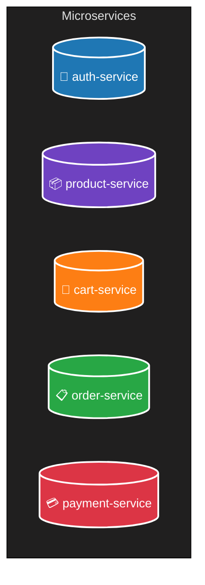

# Vidinine E-commerce Platform

## Sobre o Projeto

**Vidinine** é uma plataforma de e-commerce moderna e modular, feita para ser simples de manter e fácil de escalar. Está sendo construída com Go, React, PostgreSQL, Docker e uma arquitetura baseada em microserviços, o que garante mais flexibilidade e independência entre os serviços.

Neste repositório estão os principais serviços do sistema, organizados de forma clara. Cada um conta com documentação, diagramas e exemplos que ajudam na hora de entender, rodar e evoluir o projeto.

## 🧩 Serviços

| Serviço | Descrição | Documentação |
|---------|-----------|--------------|
| [`auth-service`](./services/auth-service/README.md) | Gerencia autenticação e autorização de usuários. | ✅ |

## ⚙️ Arquitetura de Microserviços

## 📜 Licença

Este projeto é de uso exclusivo para fins educacionais e de demonstração técnica. A redistribuição, clonagem ou reutilização sem autorização não é permitida.

---
🔧 Desenvolvido com: Go · React · PostgreSQL · Docker · GORM · JWT · RESTful APIs
