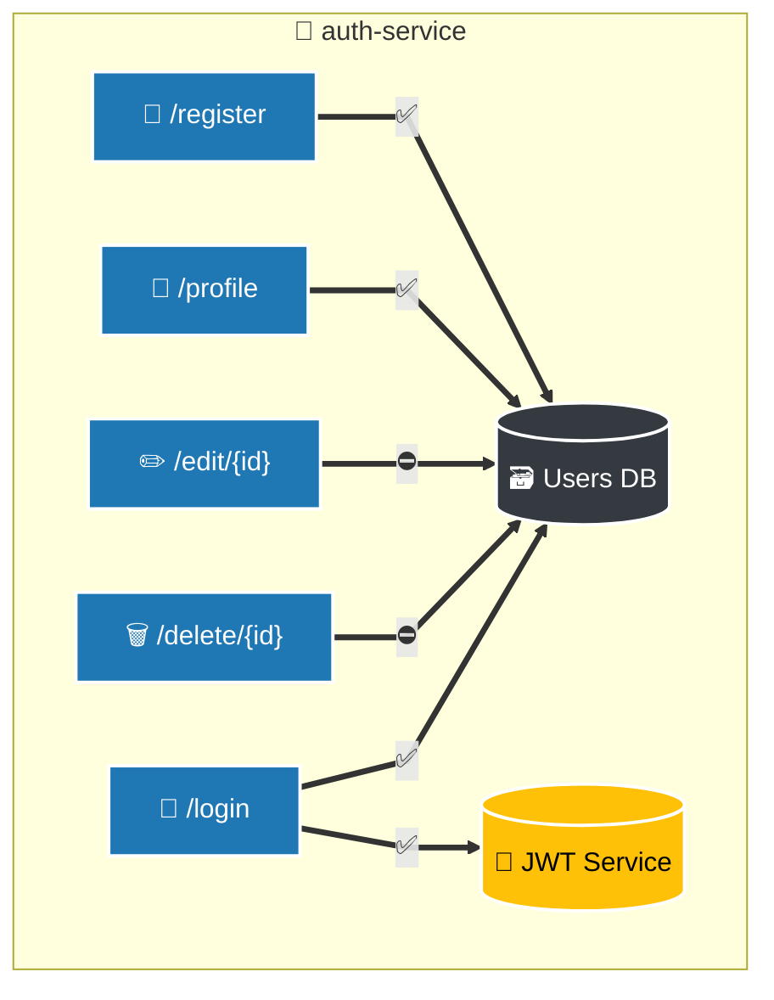

# 🔐 Auth Service

Este serviço é responsável por autenticação e autorização de usuários via JWT.

## 📋 Funcionalidades

- Registro e login de usuários
- Geração e validação de tokens JWT
- Middleware para verificação de autorização

## 📈 Diagrama de Arquitetura

## Endpoints

| ID | Função               | Método  | Endpoint         | Descrição                                                                 | Requisito                     |
|----|----------------------|---------|------------------|---------------------------------------------------------------------------|-------------------------------|
| 1  | 📝 Cadastro          | POST    | `/register`      | Registra um novo usuário no sistema.                                      | ❌ Nenhum                     |
| 2  | 🔐 Login             | POST    | `/login`         | Realiza o login do usuário e retorna um **token JWT** para autenticação.  | ❌ Nenhum                     |
| 3  | 👤 Perfil            | GET     | `/profile`       | Retorna as informações do perfil do usuário.                              | ✅ **JWT Token**              |
| 4  | ✏️ Editar            | POST    | `/update`        | Atualiza os dados de um usuário com base no id fornecido.                 | ✅ **JWT Token**              |
| 5  | 🗑️ Deletar           | DELETE  | `/delete`        | Remove o usuário identificado pelo id do sistema.                         | ✅ **JWT Token**              |
| 6  | 📋 Listar Usuários   | GET     | `/admin/users`   | Retorna uma lista de todos os usuários cadastrados no sistema.            | ✅ **JWT Token + Role: admin** |

## 🗃️ Tabelas do Banco de Dados

### Users

| Campo       | Tipo   | Tags GORM                          | Descrição                     |
|-------------|--------|------------------------------------|-------------------------------|
| 🆔 ID       | uint   | `gorm:"primaryKey"`               | Identificador único           |
| 🕒 CreatedAt| Time   |                                    | Data de criação               |
| 🕒 UpdatedAt| Time   |                                    | Data de atualização           |
| 🗑️ DeletedAt| Time   | `gorm:"index"`                    | Data de exclusão lógica       |
| 📝 Name     | string | `gorm:"not null"`                 | Nome do usuário               |
| 📧 Email    | string | `gorm:"not null;unique"`          | Email do usuário              |
| 🔒 Password | string | `gorm:"not null;size:255"`        | Senha do usuário              |
|Role| string|||